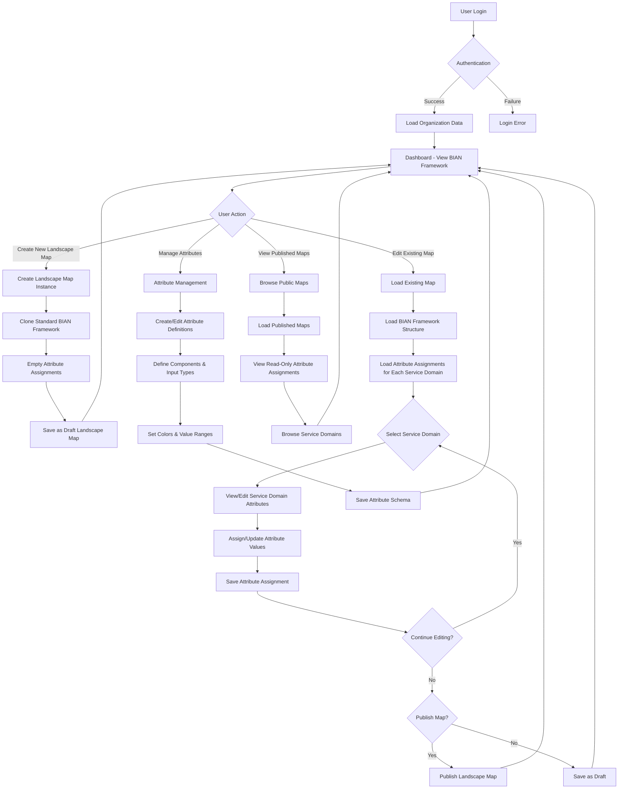
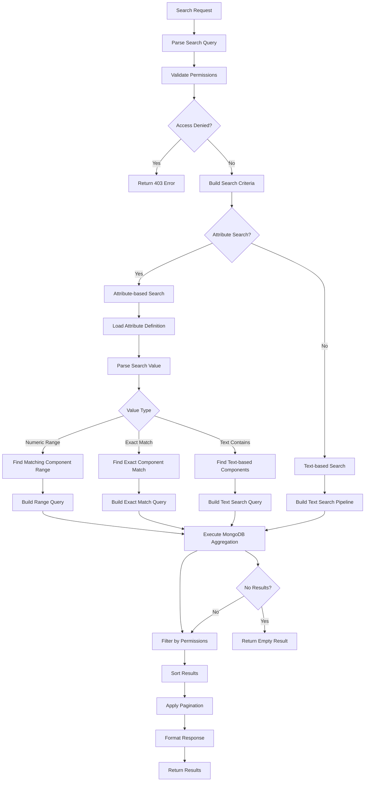

# Landscape Mapper - Backend Architecture & MongoDB Schema

## Overview
The Landscape Mapper is a comprehensive system for organizations to create, manage, and share business landscape data following the BIAN (Banking Industry Architecture Network) framework. This document outlines the MongoDB schema, API requirements, data relationships, and system flow diagrams for backend implementation.

## Core Concepts

### 1. Pre-defined BIAN Framework Structure
- **Standard BIAN Hierarchy**: Business Areas → Business Domains → Service Domains are **predefined and static**
- **Users cannot create/edit/delete** the BIAN framework structure
- **Each organization gets a copy** of the standard BIAN framework when creating a landscape map

### 2. Attribute-Only Data Management
- **Users only work with attributes** at the Service Domain level
- **Landscape Maps** contain attribute assignments for each Service Domain
- **Draft/Published workflow** applies only to attribute assignments
- **Service Domains** themselves remain unchanged - only their attribute values are managed

### 3. Multi-Tenancy & Access Control
- **Organization-based data isolation** for attribute definitions and landscape maps
- **Role-based access control** (RBAC) for attribute management
- **Publication workflow** (Draft → Published) for landscape maps with attribute assignments
- **Cross-organization visibility** for published landscape maps (read-only)

### 4. Dynamic Attribute System
- **Configurable attributes** per organization (attribute definitions)
- **Component-based values** with different input types (text, number, list, multiselect)
- **Attribute assignments** to Service Domains within landscape maps
- **Search and filtering capabilities** based on attribute values

---

## System Flow Diagrams

### Normal Data Flow Diagram


### Search Flow Diagram


---

## MongoDB Schema Design

### Core Collections

#### 1. BIAN Framework Template (Master Data)
```javascript
// Collection: bian_framework_template
{
  _id: ObjectId,
  version: String, // "13.0.0"
  name: String, // "BIAN Framework v13.0.0"
  description: String,
  isActive: Boolean, // default: true
  createdAt: Date,
  updatedAt: Date,
  businessAreas: [{
    _id: ObjectId,
    bianId: String, // "BIAN-13.0.0-ResourceManagement"
    name: String, // "Resource Management"
    description: String,
    displayOrder: Number,
    businessDomains: [{
      _id: ObjectId,
      bianId: String, // "BIAN-13.0.0-UnitManagement"
      name: String, // "Unit Management"
      description: String,
      displayOrder: Number,
      serviceDomains: [{
        _id: ObjectId,
        bianId: String, // "BIAN-13.0.0-BusinessUnitAccounting"
        name: String, // "Business Unit Accounting"
        description: String,
        displayOrder: Number,
        controlRecords: {
          description: String,
          properties: Object
        },
        behaviorQualifier: {
          description: String,
          properties: Object
        },
        businessScenario: {
          description: String,
          steps: [String],
          actors: [String]
        }
      }]
    }]
  }]
}
```

#### 2. Organizations Collection
```javascript
// Collection: organizations
{
  _id: ObjectId,
  name: String,
  slug: String,
  createdAt: Date,
  updatedAt: Date,
  isActive: Boolean,
  settings: {
    allowPublicMaps: Boolean,
    defaultMapVisibility: String // 'private' | 'public'
  }
}
```

#### 3. Users Collection
```javascript
// Collection: users
{
  _id: ObjectId,
  organizationId: ObjectId, // ref: organizations
  email: String,
  name: String,
  role: String, // 'admin' | 'editor' | 'viewer'
  avatar: String,
  lastLogin: Date,
  createdAt: Date,
  updatedAt: Date,
  isActive: Boolean,
  preferences: {
    theme: String, // 'light' | 'dark'
    defaultView: String // 'grid' | 'list'
  }
}
```

#### 4. Landscape Maps Collection
```javascript
// Collection: landscape_maps
{
  _id: ObjectId,
  organizationId: ObjectId, // ref: organizations
  name: String,
  description: String,
  version: String,
  status: String, // 'draft' | 'published'
  isPublic: Boolean,
  createdBy: ObjectId, // ref: users
  createdAt: Date,
  updatedAt: Date,
  publishedAt: Date,
  bianFrameworkVersion: String, // "13.0.0"
  metadata: {
    tags: [String],
    industry: String,
    region: String,
    lastEditedBy: ObjectId // ref: users
  },
  serviceDomainAttributes: [{
    serviceDomainBianId: String, // "BIAN-13.0.0-BusinessUnitAccounting"
    attributes: [{
      attributeId: ObjectId, // ref: attributes
      selectedValues: [{
        componentId: String,
        values: [Object] // string, number, or array
      }],
      assignedAt: Date,
      assignedBy: ObjectId, // ref: users
      notes: String
    }],
    lastUpdated: Date,
    updatedBy: ObjectId // ref: users
  }]
}
```

#### 4. Attributes Collection
```javascript
// Collection: attributes
{
  _id: ObjectId,
  organizationId: ObjectId, // ref: organizations
  title: String, // required
  description: String,
  isActive: Boolean, // default: true
  createdAt: Date, // default: Date.now
  updatedAt: Date, // default: Date.now
  createdBy: ObjectId, // ref: users
  // Components define the possible values and their properties
  components: [{
    _id: ObjectId,
    componentId: String, // required, unique within attribute
    inputType: String, // enum: ['text', 'number', 'list', 'multiselect']
    color: String, // hex color code, e.g., "#FF5733"
    displayOrder: Number, // default: 0
    // Values structure depends on input type
    values: {
      // For 'text': not used (free text input)
      // For 'number': { min: Number, max: Number, unit: String }
      // For 'list': [String] - array of options
      // For 'multiselect': [String] - array of options
      options: [String], // for list/multiselect
      ranges: [{ // for number ranges like "Low 1-10"
        label: String, // "Low", "Medium", "High"
        min: Number,
        max: Number,
        operator: String // "between", "lt", "gt", "eq"
      }],
      validation: {
        required: Boolean,
        pattern: String, // regex for text validation
        minLength: Number,
        maxLength: Number
      }
    },
    metadata: {
      description: String,
      examples: [String],
      unit: String // for number inputs
    }
  }],
  // Usage statistics
  usage: {
    totalUsage: Number, // default: 0
    lastUsed: Date,
    popularComponents: [String] // component IDs
  }
}

// Indexes:
// { "organizationId": 1, "title": 1 } - unique compound
// { "organizationId": 1, "isActive": 1 }
// { "components.componentId": 1 }
```

---

## MongoDB Data Examples

### Sample Attribute Document (Head Count Example)
```javascript
{
  _id: ObjectId("64f1a2b3c4d5e6f7g8h9i0j1"),
  organizationId: ObjectId("64f1a2b3c4d5e6f7g8h9i0j2"),
  title: "Head Count",
  description: "Employee count ranges for service domains",
  isActive: true,
  createdAt: ISODate("2024-01-15T10:30:00Z"),
  updatedAt: ISODate("2024-01-15T10:30:00Z"),
  createdBy: ObjectId("64f1a2b3c4d5e6f7g8h9i0j3"),
  components: [
    {
      _id: ObjectId("64f1a2b3c4d5e6f7g8h9i0j4"),
      componentId: "low_range",
      inputType: "list",
      color: "#4CAF50", // Green
      displayOrder: 0,
      values: {
        ranges: [{
          label: "Low",
          min: 1,
          max: 10,
          operator: "between"
        }],
        options: ["Low (1-10)"]
      },
      metadata: {
        description: "Small team size",
        unit: "employees"
      }
    },
    {
      _id: ObjectId("64f1a2b3c4d5e6f7g8h9i0j5"),
      componentId: "medium_range", 
      inputType: "list",
      color: "#FF9800", // Orange
      displayOrder: 1,
      values: {
        ranges: [{
          label: "Medium",
          min: 11,
          max: 150,
          operator: "between"
        }],
        options: ["Medium (11-150)"]
      }
    },
    {
      _id: ObjectId("64f1a2b3c4d5e6f7g8h9i0j6"),
      componentId: "high_range",
      inputType: "list", 
      color: "#F44336", // Red
      displayOrder: 2,
      values: {
        ranges: [{
          label: "High",
          min: 151,
          max: null, // No upper limit
          operator: "gt"
        }],
        options: ["High (>150)"]
      }
    }
  ],
  usage: {
    totalUsage: 15,
    lastUsed: ISODate("2024-01-20T14:22:00Z"),
    popularComponents: ["medium_range", "high_range"]
  }
}
```

### Sample Service Domain with Assigned Attributes
```javascript
// Within a landscape_maps document, serviceDomains array item:
{
  _id: ObjectId("64f1a2b3c4d5e6f7g8h9i0j7"),
  bianId: "BIAN-13.0.0-CustomerRelationshipManagement",
  name: "Customer Relationship Management",
  description: "Manage customer relationships and interactions",
  displayOrder: 0,
  controlRecords: {},
  behaviorQualifier: {},
  businessScenario: {},
  attributes: [
    {
      attributeId: ObjectId("64f1a2b3c4d5e6f7g8h9i0j1"), // Head Count attribute
      selectedValues: [{
        componentId: "high_range",
        values: ["High (>150)"] // Selected the high range option
      }],
      assignedAt: ISODate("2024-01-16T09:15:00Z"),
      assignedBy: ObjectId("64f1a2b3c4d5e6f7g8h9i0j3")
    },
    {
      attributeId: ObjectId("64f1a2b3c4d5e6f7g8h9i0j8"), // Technology Stack attribute
      selectedValues: [{
        componentId: "tech_stack",
        values: ["React", "Node.js", "MongoDB"] // Multiselect values
      }],
      assignedAt: ISODate("2024-01-16T09:20:00Z"),
      assignedBy: ObjectId("64f1a2b3c4d5e6f7g8h9i0j3")
    }
  ]
}
```

---

## API Endpoints Structure

### Organization Management
```
GET    /api/organizations              # List organizations (public data only)
POST   /api/organizations              # Create organization
GET    /api/organizations/{id}         # Get organization details
PUT    /api/organizations/{id}         # Update organization
DELETE /api/organizations/{id}         # Delete organization
```

### BIAN Framework (Read-Only)
```
GET    /api/bian-framework                     # Get active BIAN framework structure
GET    /api/bian-framework/versions           # List all BIAN framework versions
GET    /api/bian-framework/{version}          # Get specific framework version
GET    /api/bian-framework/service-domains    # List all service domains with hierarchy
GET    /api/bian-framework/service-domains/{bianId} # Get specific service domain details
```

### Landscape Maps (Attribute Assignments)
```
GET    /api/landscape-maps                    # List maps (org + public)
POST   /api/landscape-maps                    # Create new map (clones BIAN framework)
GET    /api/landscape-maps/{id}               # Get map with attribute assignments
PUT    /api/landscape-maps/{id}               # Update map metadata only
DELETE /api/landscape-maps/{id}               # Delete map
POST   /api/landscape-maps/{id}/publish       # Publish map
POST   /api/landscape-maps/{id}/duplicate     # Duplicate map with attributes
GET    /api/landscape-maps/{id}/combined      # Get map with full BIAN structure + attributes
```

### Service Domain Attribute Management
```
# Service Domain Attributes (within a landscape map)
GET    /api/landscape-maps/{mapId}/service-domains/{bianId}/attributes
                                              # Get attribute assignments for service domain
POST   /api/landscape-maps/{mapId}/service-domains/{bianId}/attributes
                                              # Assign new attribute to service domain
PUT    /api/landscape-maps/{mapId}/service-domains/{bianId}/attributes/{attrId}
                                              # Update attribute assignment
DELETE /api/landscape-maps/{mapId}/service-domains/{bianId}/attributes/{attrId}
                                              # Remove attribute assignment

# Bulk operations
POST   /api/landscape-maps/{mapId}/attributes/bulk-assign
                                              # Bulk assign attributes to multiple service domains
POST   /api/landscape-maps/{mapId}/attributes/bulk-update
                                              # Bulk update attribute assignments
```

### Attribute Definition Management
```
# Attribute Management (Organization-scoped)
GET    /api/attributes                 # List organization attributes
POST   /api/attributes                 # Create new attribute definition
GET    /api/attributes/{id}            # Get attribute definition with components
PUT    /api/attributes/{id}            # Update attribute definition
DELETE /api/attributes/{id}            # Delete attribute (if not in use)

# Attribute Components
POST   /api/attributes/{id}/components # Add component to attribute
PUT    /api/attributes/{id}/components/{componentId} # Update component
DELETE /api/attributes/{id}/components/{componentId} # Delete component

# Attribute Usage Analytics
GET    /api/attributes/{id}/usage      # Get usage statistics for attribute
GET    /api/attributes/popular         # Get most used attributes in organization
```

### Search & Discovery
```
# Advanced Search
POST   /api/search/service-domains     # Search service domains by attributes
POST   /api/search/landscape-maps      # Search landscape maps
GET    /api/search/suggestions         # Get search suggestions for attributes

# Analytics
GET    /api/analytics/attribute-usage  # Attribute usage patterns
GET    /api/analytics/popular-searches # Popular search queries
```

---

## MongoDB Search Implementation

### Search Query Structure
```javascript
{
  landscapeMapId: ObjectId("64f1a2b3c4d5e6f7g8h9i0j1"), // optional, null for global search
  filters: [
    {
      attributeId: ObjectId("64f1a2b3c4d5e6f7g8h9i0j1"),
      attributeTitle: "Head Count",
      operator: "range", // "equals", "contains", "range", "in", "text_search"
      value: 200, // Search value
      componentMatch: "auto" // Auto-detect which component matches
    },
    {
      attributeId: ObjectId("64f1a2b3c4d5e6f7g8h9i0j8"),
      attributeTitle: "Technology Stack",
      operator: "in",
      value: ["React", "MongoDB"]
    }
  ],
  textSearch: "Customer Management", // General text search
  includeDrafts: false,
  organizationFilter: "all", // "all", "own", "public"
  pagination: {
    page: 1,
    limit: 20
  },
  sort: {
    field: "relevance", // "relevance", "name", "updatedAt"
    order: "desc"
  }
}
```

### Search Implementation

The search functionality supports complex attribute queries across nested service domains with proper access control and performance optimization.

---

## Data Access Patterns

### Access Control Rules

1. **Draft Maps**: Only organization members can view/edit
2. **Published Maps**: 
   - Organization members: full access
   - Other organizations: read-only access
3. **Attributes**: Organization-scoped, not shared across organizations

## API Endpoints Structure

### Landscape Map Endpoints
- `GET /api/landscape-maps` - List landscape maps for organization
- `POST /api/landscape-maps` - Create new landscape map
- `GET /api/landscape-maps/:id` - Get specific landscape map
- `PUT /api/landscape-maps/:id` - Update landscape map
- `DELETE /api/landscape-maps/:id` - Delete landscape map
- `POST /api/landscape-maps/:id/publish` - Publish landscape map
- `POST /api/landscape-maps/:id/duplicate` - Duplicate landscape map

### Attribute Endpoints  
- `GET /api/attributes` - List attributes for organization
- `POST /api/attributes` - Create new attribute
- `PUT /api/attributes/:id` - Update attribute
- `DELETE /api/attributes/:id` - Delete attribute

### Search Endpoints
- `POST /api/search/service-domains` - Search service domains with filters
- `GET /api/search/suggestions` - Get search suggestions

## Monitoring & Analytics Schema

### Analytics Collections

#### Usage Analytics
```
{
  _id: ObjectId,
  userId: ObjectId,
  organizationId: ObjectId,
  landscapeId: ObjectId,
  action: String, // "view", "edit", "search", "create", etc.
  details: {
    searchQuery: String,
    attributesUsed: [ObjectId],
    timeSpent: Number // milliseconds
  },
  timestamp: Date,
  ipAddress: String,
  userAgent: String
}
```

#### Search Analytics
```
{
  _id: ObjectId,
  organizationId: ObjectId,
  searchQuery: String,
  filters: [],
  resultsCount: Number,
  executionTime: Number, // milliseconds
  timestamp: Date
}
```

#### Attribute Usage Analytics
```
{
  _id: ObjectId,
  organizationId: ObjectId,
  attributeId: ObjectId,
  usageCount: Number,
  lastUsed: Date,
  popularComponents: [String]
}
```

### Key Metrics to Track
- Total landscape maps created
- Published vs Draft maps ratio
- Active users per month  
- Storage usage per organization
- Most searched attributes
- Popular search patterns
- Average session duration
- Most viewed service domains
- Cross-organization map views
- Average search response time
- Database query performance
- API endpoint response times
- Cache hit rates

---

## Conclusion

This MongoDB-based architecture provides a scalable, multi-tenant system that supports:

### ✅ **Core Features Delivered:**
- **Hierarchical Data Structure** with embedded documents for performance
- **Dynamic Attribute System** with flexible component-based values  
- **Advanced Search Capabilities** using MongoDB aggregation pipelines
- **Multi-tenant Access Control** with organization-based data isolation
- **Draft/Published Workflow** with cross-organization visibility
- **Performance Optimization** through strategic indexing and caching

### 🔧 **Technical Benefits:**
- **Document-oriented storage** naturally fits the hierarchical BIAN structure
- **Flexible schema** supports evolving attribute requirements
- **Aggregation pipelines** enable complex search queries
- **Horizontal scalability** through MongoDB sharding
- **Rich indexing** supports various query patterns

### 📊 **Search Implementation Highlights:**
- **Range-based matching** for numeric attributes (e.g., Head Count: 200 → "High >150")
- **Multi-attribute filtering** with AND/OR logic
- **Full-text search** across all hierarchy levels
- **Permission-aware results** based on organization access
- **Optimized performance** with proper indexing strategy

### 🚀 **Ready for Development:**
- Complete MongoDB schema with indexes
- Comprehensive API endpoint structure  
- Detailed search aggregation pipelines
- Access control and security patterns
- Performance monitoring and analytics
- Seed data and migration strategies

This architecture ensures the Landscape Mapper can handle complex organizational data while providing fast, secure, and scalable search capabilities across the BIAN framework hierarchy.